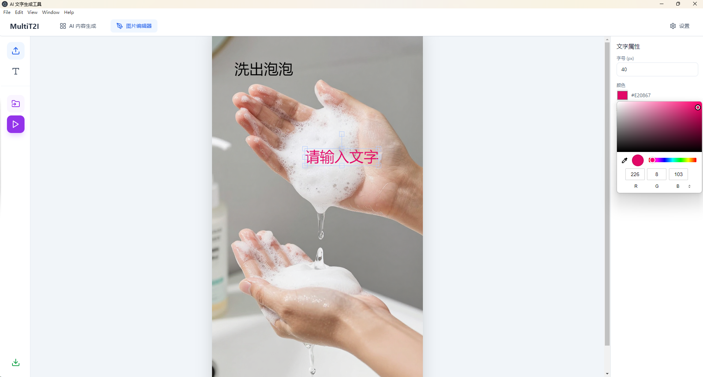
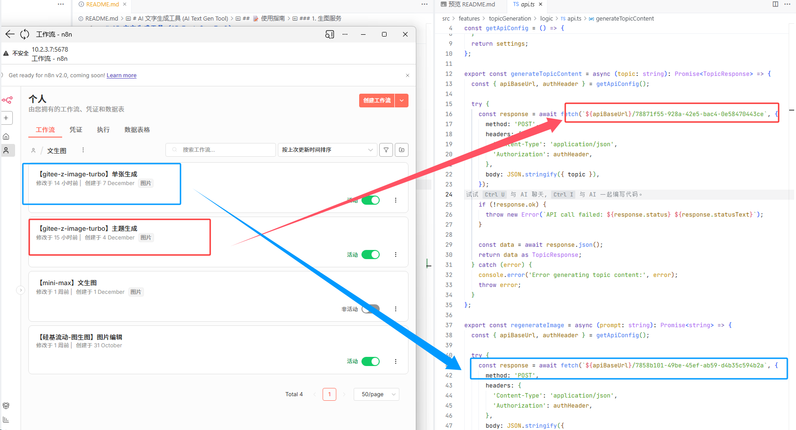
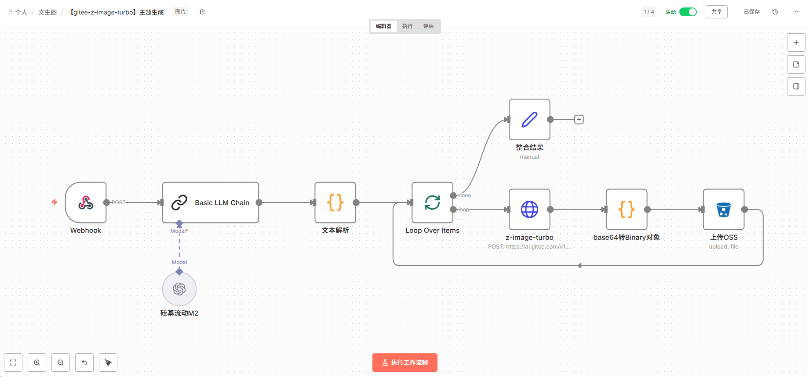
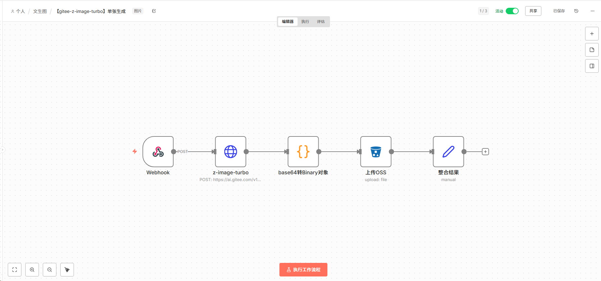
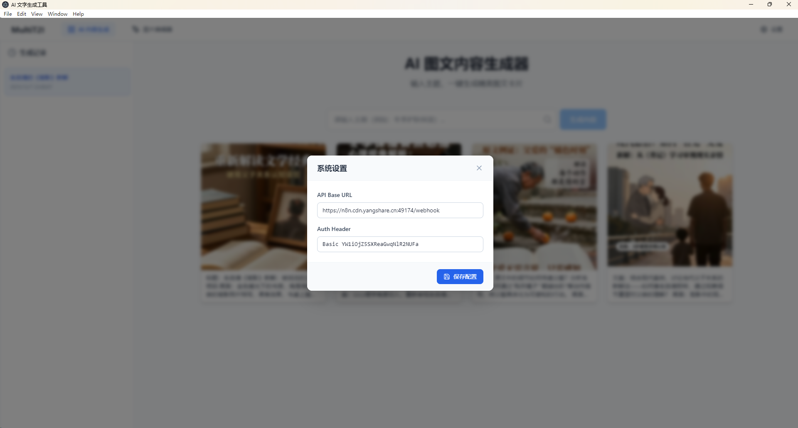

# AI 图文生成工具 (MediaPicGen)

这是一个基于 Electron、React 和 Fabric.js 开发的桌面应用程序，依托z-image开源生图模型，旨在提供便捷的图片文字编辑及批量处理功能。

## ✨ 主要功能

### 🎨 AI 内容生成
*   **智能图文创作**：输入主题即可自动生成图文并茂的创意卡片。
*   **历史记录管理**：自动保存生成记录，支持随时回看与删除。
*   **沉浸式预览**：支持高清大图全屏预览，键盘左右切换查看。
*   **文案二次编辑**：预览模式下支持直接修改文案并实时保存同步。
*   **智能重绘**：对不满意的配图支持单张快速重新生成。
*   **无缝工作流**：支持一键将生成的图片导入编辑器进行深度加工。


### 🖌️ 图片编辑器
*   **可视化画布**：支持拖拽导入图片，自由添加和编辑文字对象。
*   **文字属性调整**：实时调整文字的字体、大小、颜色、位置等属性。
*   **批量处理**：支持一次性导入多张图片，将设计好的文字模板自动应用到所有图片上。
*   **一键导出**：支持单张快速导出或批量打包下载 ZIP。
*   **🚀 自动更新**：应用启动时自动检测 GitHub Release 新版本，支持增量下载与自动安装，时刻保持最新体验。



## 🛠️ 技术栈

*   **核心框架**：[Electron](https://www.electronjs.org/) + [React](https://react.dev/)
*   **构建工具**：[Vite](https://vitejs.dev/)
*   **语言**：TypeScript
*   **图形处理**：[Fabric.js](http://fabricjs.com/)
*   **样式库**：[Tailwind CSS](https://tailwindcss.com/) + [Lucide React](https://lucide.dev/) (图标)
*   **工具库**：
    *   `jszip`: 用于批量导出时的文件压缩。
    *   `file-saver`: 用于文件保存。

## 🚀 快速开始

### 环境要求

*   Node.js (建议 v16+)
*   npm 或 yarn

### 安装依赖

```bash
npm install
```

### 开发环境运行

同时启动 Vite 开发服务器和 Electron 应用：

```bash
npm run dev
```

### 打包构建

#### Windows 一键打包（推荐）

项目根目录下提供了 `build.bat` 脚本，双击运行即可完成所有打包步骤。

1. 双击运行 `build.bat`。
2. 脚本会自动清理旧文件、编译代码并打包应用。
3. 打包完成后，可执行文件位于 `release-packager/MediaPicGen-win32-x64/MediaPicGen.exe`。

#### 手动打包

如果你需要手动分步执行：

```bash
# 1. 编译源代码
pnpm run compile

# 2. 执行打包
# 确保已安装 electron-packager
pnpm exec electron-packager . MediaPicGen --platform=win32 --arch=x64 --out=release-packager --overwrite
```

### 🔄 自动发布与更新

本项目集成了 GitHub Actions 与 electron-updater 实现自动化发布与更新流程。

**如何发布新版本：**

1.  **提交代码**：确保本地代码已提交并推送到 GitHub。
2.  **打标签 (Tag)**：创建一个以 `v` 开头的标签（如 `v1.0.1`）。
    ```bash
    git tag v1.0.1
    git push origin v1.0.1
    ```
3.  **自动构建**：GitHub Actions 会自动触发构建流程，打包 Windows 安装包 (`.exe`) 并生成更新配置文件 (`latest.yml`)。
4.  **发布 Release**：构建完成后，会自动在 GitHub Releases 页面发布一个 Pre-release 版本。
5.  **用户更新**：用户打开旧版本应用时，会自动检测到新版本并提示更新。

## 📂 项目结构

```
├── electron/        # Electron 主进程代码
├── src/             # React 渲染进程代码
│   ├── components/  # UI 组件 (Sidebar, PropertyPanel, BatchPanel)
│   ├── hooks/       # 自定义 Hooks (useFabric)
│   ├── App.tsx      # 主应用逻辑
│   └── main.tsx     # 入口文件
├── dist-electron/   # Electron 编译输出
├── package.json     # 项目依赖与脚本配置
└── README.md        # 项目说明文档
```

## 📝 使用指南

### 1. 生图服务搭建

为了灵活性和后期扩展性，目前生图服务是用n8n工作流配置的
[接口调用逻辑可见api.ts](src/features/topicGeneration/logic/api.ts),对应关系如下图：


主题生成服务流程如下：

> [【gitee-z-image-turbo】主题生成.json](n8n/【gitee-z-image-turbo】主题生成.json)

单张生成服务流程如下：

> [【gitee-z-image-turbo】单张生成.json](n8n/【gitee-z-image-turbo】单张生成.json)

### 2. 桌面系统配置


> 懒得搭建n8n工作流？体验卡获取方式：扫描下方二维码，发消息“AI文字生成工具”自动获取。  
 

### 3. AI 内容生成
1.  **生成内容**：在顶部输入框输入主题（如“冬季护肤”），点击生成按钮。
2.  **查看结果**：生成的图文卡片会以网格形式展示，鼠标悬停可查看更多选项。
3.  **全屏预览与编辑**：
    *   点击卡片（非按钮区）进入全屏预览。
    *   **切换图片**：点击屏幕左右侧按钮或使用键盘 `←` `→` 键切换。
    *   **修改文案**：直接点击左侧文案区域进行编辑，修改后点击右上角“保存”按钮即可。
4.  **重新生成**：鼠标悬停在卡片上，点击蓝色“重新生成”按钮，AI 将为您更换配图。
5.  **导入编辑**：鼠标悬停在卡片上，点击“图片编辑”按钮，当前图片将直接跳转至编辑器。
6.  **历史回溯**：左侧边栏按时间轴记录了所有生成历史，点击即可快速切换回看。

### 4. 图片编辑器
1.  **导入底图**：点击左侧工具栏的“上传模板图”按钮，或从 AI 生成页面跳转而来。
2.  **添加文字**：点击“添加文字”按钮，画布上会出现可编辑的文本框。
3.  **调整样式**：选中文字后，在右侧属性面板调整文字的大小、颜色、字体等。
4.  **批量处理**：
    *   点击左侧“批量导入”按钮，选择多张待处理图片。
    *   点击“批量处理”按钮，程序会将当前画布上的文字模板应用到所有图片上，并自动下载 ZIP 包。

## 📄 许可证

MIT
